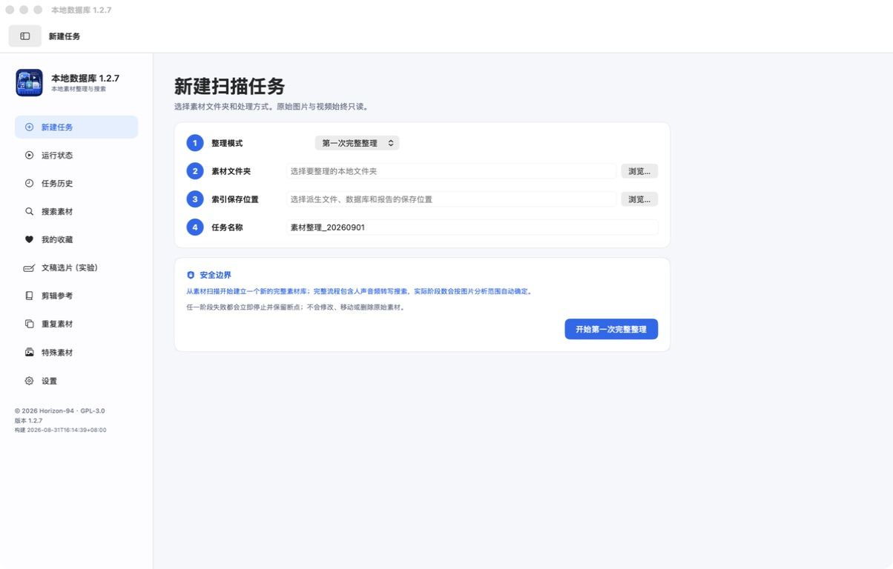
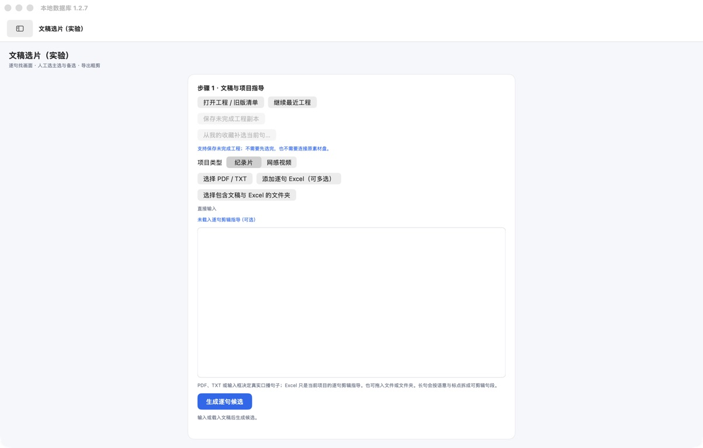
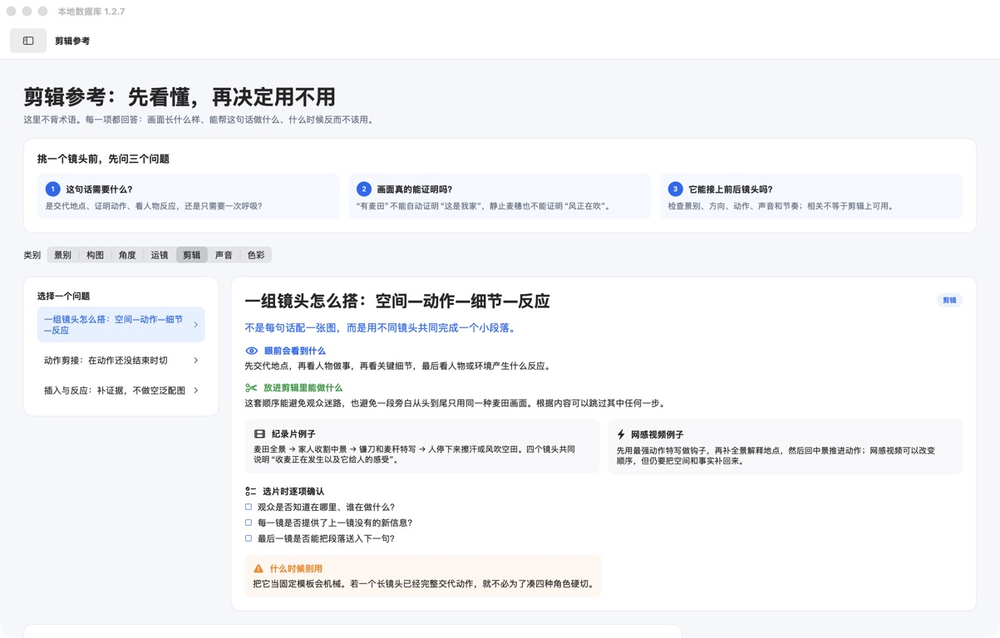

# 本地数据库（Local Media Organizer）

一个面向 macOS 的本地素材整理与搜索工具。它可以扫描图片和视频、生成预览与抽帧、建立本地 SQLite 索引，并通过 OCR、视觉标签、图文描述和向量检索提供离线搜索。

当前维护源码记录：**1.2.7**（2026-08-31）。

本次同步已经验证的通用搜索、选片界面和跨素材库查询源码、合成数据测试与版本记录。
规则不绑定具体文稿、题材、人物、素材库名称或本机数据库路径。
详见 [1.2.7 发行说明](docs/releases/1.2.7.md)。

1.2.7同时提供通用源码和适用于苹果M系列芯片电脑的完整安装包。安装包内含程序与六套Python运行环境，
但不包含AI模型、数据库、素材或用户配置；安装后由用户在设置页选择自行下载的模型总目录。

版权所有：**Copyright (C) 2026 [Horizon-94](https://github.com/Horizon-94)**
官方源码：<https://github.com/Horizon-94/local-media-organizer>

## 软件界面

### 新建素材整理任务



### 文稿选片实验入口

支持 PDF、TXT、直接输入和逐句 Excel 指导；系统提供候选，最终由用户选择主选、备选或保留人物口播。



### 剪辑参考

从景别、构图、角度、运镜、剪辑、声音和色彩解释一个镜头能承担什么、不能证明什么，以及如何连接前后镜头。



## 延续的核心能力（来自1.2.3）

- 保留逐视频原子断点、worker 恢复、中央数据库、强指纹、多历史索引切换、音频转写搜索和只读搜索。
- 人物结果新增“查看侧脸/背影候选”：复用既有人脸锚点、YOLOE 人体框和同一视频的时间连续性生成待人工确认候选。
- 候选只用于复核，不自动跨视频认定身份，也不会修改既有人脸 embedding、人物组或中央数据库。
- 人物名称、标签、收藏、备注、人工合并/拆分继续保存在所选索引的本地覆盖层。
- 发行构建改用精简白名单，只打包当前运行所需脚本、配置和迁移；历史实验脚本不进入 App。
- App 内含当前脚本和六套便携 Python 运行环境；模型、用户数据库、素材与本机配置保持外置。

这些历史能力的完整说明见 [1.2.3版本说明](docs/releases/1.2.3.md)。

## 下载和使用

普通用户优先从 GitHub“版本发布”页面下载由 Horizon-94 发布的Mac安装包（DMG文件）。
安装包内含应用和 Python 运行环境，但**不含任何第三方AI模型**。
官方 1.2.7 通用安装包仅面向苹果M系列芯片电脑，不提供 Intel、
Rosetta 或 Universal Binary 兼容构建。

1. 把 DMG 中的 `本地数据库 1.2.7.app` 拖入“应用程序”。
2. 按 [模型安装说明](docs/MODEL_SETUP.md) 下载模型。
3. 默认把模型放到：

   ```text
   ~/Library/Application Support/素材大整理/Models
   ```

4. 打开应用，在“设置 → 本地模型位置”中选择模型总目录并点击“检查并保存”。
5. 11项模型全部显示“已找到”后退出并重新打开应用。
6. 第一次运行时选择素材目录和索引输出目录；原始素材保持只读。

### 第一次建立素材库

1. 打开“新建任务”，选择“第一次完整整理”。
2. “素材文件夹”选择原始图片和视频所在目录；软件只读访问，不移动、不重命名、不覆盖原片。
3. “索引保存位置”选择有足够空间的独立目录，用于数据库、预览、抽帧和报告。
4. 确认任务名称后开始。任一阶段失败都会保留断点，后续从“运行状态”或“任务历史”检查。

### 搜索素材

- “当前素材库”只搜索当前选择的数据库。
- “全部素材库”逐个只读查询所有已登记数据库，再统一排序并合并同一原文件的重复结果。
- “全部画面”主要搜索图片、视频画面描述、物体标签、OCR和视觉向量；人声转写请单独选择音频搜索，不会与普通画面结果混排。
- 同一视频的相邻画面会合并为一条结果，可使用“浏览该视频全部画面”查看其他时间点。
- 播放、Finder定位、收藏和备注始终使用结果实际所属的素材库。

### 文稿选片与粗剪导出

1. 进入“文稿选片（实验）”，选择纪录片或网感视频。
2. 导入 PDF、TXT，或直接粘贴文稿；逐句 Excel 只作为可选剪辑指导，不会替换真实口播文稿。
3. 系统按句子、上下文、已有画面描述和剪辑职责提供候选；用户决定主选、备选、拒绝、保留人物口播或素材缺口。
4. 主选进入第一视频层，备选作为第二层参考；剪点可播放原片后人工调整并锁定。
5. 完成后导出FCPXML粗剪时间线文件，以及记录每句选择结果的JSON剪辑清单。DaVinci Resolve可以导入FCPXML，重新连接原始素材后继续精剪。

文稿选片是人工辅助工具，不会自动替用户作最终剪辑决定。没有合适画面时，保留人物口播或明确记录素材缺口都是合法结果。

官方 Release 如未使用 Apple Developer ID 签名和公证，会被 macOS
Gatekeeper 提示。请只下载 Horizon-94 仓库中的发布附件，并核对发布页
提供的 SHA-256。当前维护者尚未持有 Developer ID 证书。

## 发布范围

本仓库是“仅源码”公开仓库，包含：

- Python 后端、Swift 原生前台源码和构建脚本；
- 数据库迁移与运行配置；
- 单元测试、接口冻结记录和开发阶段文档；
- 模型来源与本地部署说明。

本仓库不包含：

- 原始图片、视频或音频；
- 真实 SQLite 数据库、索引或搜索记录；
- 模型权重、Tokenizer、缓存或运行环境；
- Git 历史中的 `.app`、DMG、ZIP 或其他构建产物；
- 本地日志、测试输出、绝对用户路径或访问令牌。

经过隐私审计的 DMG 可以单独作为 GitHub Release 附件发布；它不会进入
Git 历史，也不会包含模型、真实数据库、素材或本机配置。

## 设计原则

1. 原始素材只读，不移动、不重命名、不覆盖。
2. 数据库集中保存派生信息和来源关系。
3. 模型必须从用户明确配置的本地路径加载。
4. 默认关闭模型和数据的自动下载。
5. 搜索入口只读，流水线写入必须显式确认输出目录。

## 硬件与并发

1.2.3 **不把所有电脑固定成开发机的 32 GB 配置**。首次打开和新建任务时，
应用会读取芯片名称、CPU 核数、GPU 核数（系统可提供时）和统一内存：

- CPU 核数和统一内存共同决定保守默认并发；
- 设置页同时显示“默认推荐”和“本机估算上限”；
- 模型并发可在 1–8 路之间调整，抽帧并发可在 1–16 路之间调整；
- 更高配置的 Mac 可以在估算上限内提高并发，低配机器应采用较低值；
- 应用不会静默提高并发；当前版本也不会在运行中自动降档，出现交换内存
  快速增长、界面卡顿或模型退出时，应停止任务并降低并发。

在 CPU 核数足够时，当前保守算法的大致模型并发为：16 GB 默认 1 路；
24 GB 默认 2 路、估算上限 3 路；32 GB 默认 3 路、估算上限 4 路；
64 GB 默认 4 路、估算上限 8 路。这是安全起点，不是性能保证；不同芯片、
模型版本、图片分辨率和同时运行的软件都会改变实际承载能力。

基于 M1 Max 32GB 大型真实任务，并结合 Apple 官方硬件规格整理的逐阶段说明见
[Apple Silicon 硬件、并发与耗时估算](docs/HARDWARE_CONCURRENCY_ESTIMATES.md)。
其中 M5 Max 128GB 与 M3 Ultra 256GB 的并发和耗时均明确标注为**估算**，
尚未经过本项目实机验证。

## 开发环境

最低要求：

- macOS 13 或更新版本；
- Python 3.10 或更新版本；
- Xcode Command Line Tools；
- `ffmpeg`、`ffprobe` 和系统 `sips`。

安装基础开发依赖：

```bash
python3 -m venv .venv
source .venv/bin/activate
python -m pip install -e '.[dev]'
```

运行不加载模型的核心测试：

```bash
python -m pytest -q \
  tests/test_media_archive_search_readiness_v1.py \
  tests/test_media_archive_repository_schema_compat_v1.py \
  tests/test_media_archive_native_bridge_state_v1.py
```

执行源码公开审计：

```bash
python scripts/public_release_audit.py .
```

完整的空白 Mac 构建步骤见 [从源码构建](docs/BUILD_FROM_SOURCE.md)。

## 本地模型

模型不会随本仓库或 DMG 分发，也不会由应用自动下载。请先阅读
[模型安装说明](docs/MODEL_SETUP.md) 和 [模型来源与许可](MODEL_SOURCES.md)。

应用默认读取：

```bash
export MEDIA_ARCHIVE_MODEL_ROOT="$HOME/Library/Application Support/素材大整理/Models"
```

运行以下命令只会创建目录并打印上游链接，不会下载模型：

```bash
python scripts/prepare_model_directories.py
```

`configs/model_sources_v1.json` 固定所需相对路径、上游页面和许可提醒。
应用只验证本地文件是否就绪。

## 构建 macOS 应用

源码构建：

```bash
python scripts/04_media_archive_app/build_native_image_video_app_v1.py
```

构建包含六套 Python 运行环境、但不包含模型的通用 DMG：

```bash
MEDIA_ARCHIVE_ENV_ROOT="/path/to/python-environments" \
python scripts/04_media_archive_app/build_native_image_video_app_v1.py \
  --portable-runtimes --dmg
```

发布前必须运行：

```bash
python scripts/release_artifact_audit.py dist/本地数据库.app
```

构建脚本只做 ad-hoc 本地签名。公开分发的无警告安装体验仍需要 Apple
Developer ID Application 证书和 Apple 公证。

## 隐私

详见 [PRIVACY.md](PRIVACY.md)。问题报告中请勿上传真实数据库、素材路径、模型路径或日志全文。

## 开源许可

当前源码采用 [GNU GPL v3.0 only](LICENSE)。分发修改版本时必须遵守
GPL-3.0 的对应源码、许可证、版权和修改声明要求。GPL 允许收费，但不允许
把本程序的衍生版本作为闭源程序分发。

早期 Apache-2.0 发布的授权历史见 [LICENSE_HISTORY.md](LICENSE_HISTORY.md)；
旧授权不能撤回。项目身份和社区期望见
[COMMUNITY_GUIDELINES.md](COMMUNITY_GUIDELINES.md)。

## 维护

- 版本变化见 [CHANGELOG.md](CHANGELOG.md)。
- 历史版本路线见 [VERSION_HISTORY.md](docs/history/VERSION_HISTORY.md)。
- 已知问题与修复经验见 [KNOWN_ISSUES_AND_FIXES.md](docs/history/KNOWN_ISSUES_AND_FIXES.md)。
- 安全问题见 [SECURITY.md](SECURITY.md)。
- 贡献方式见 [CONTRIBUTING.md](CONTRIBUTING.md)。
